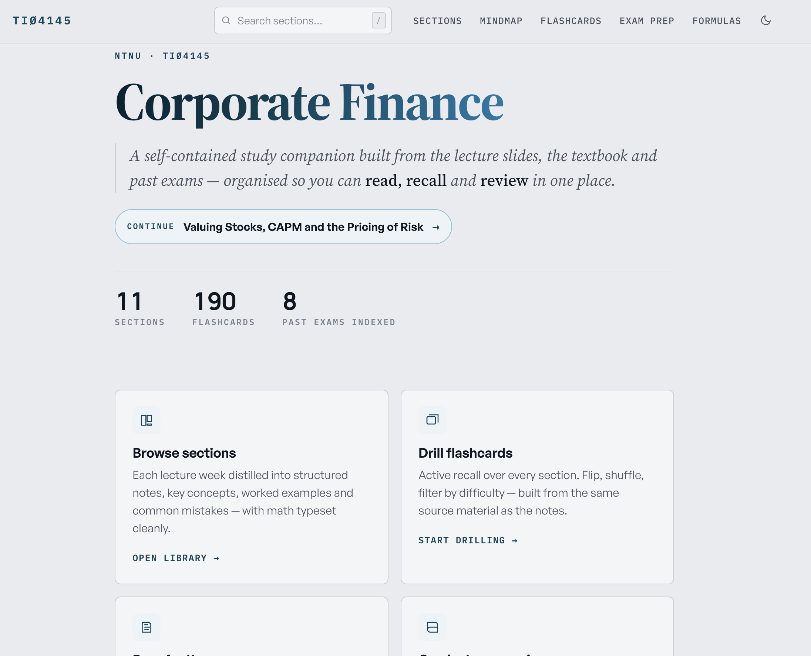
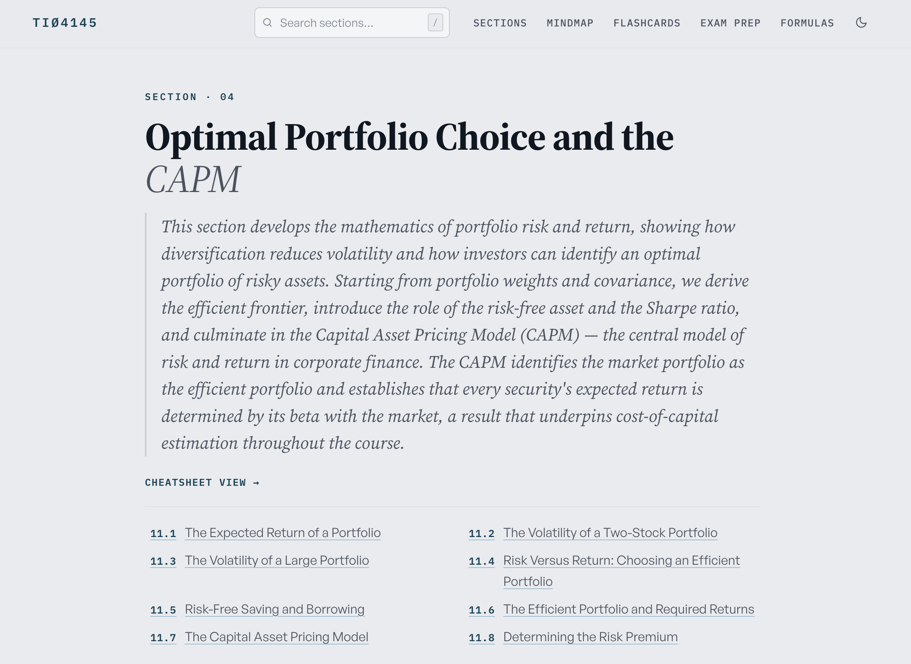
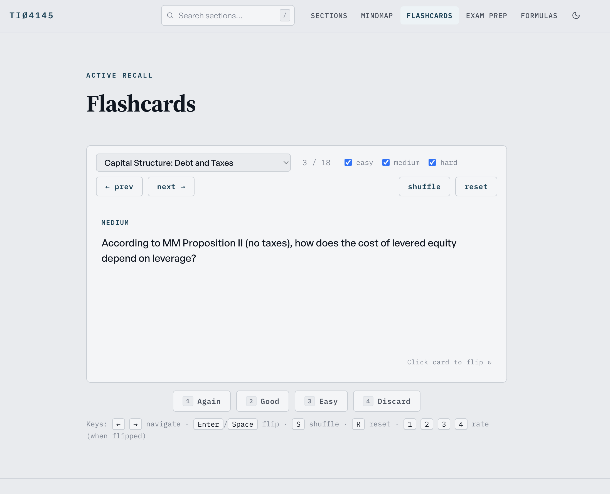
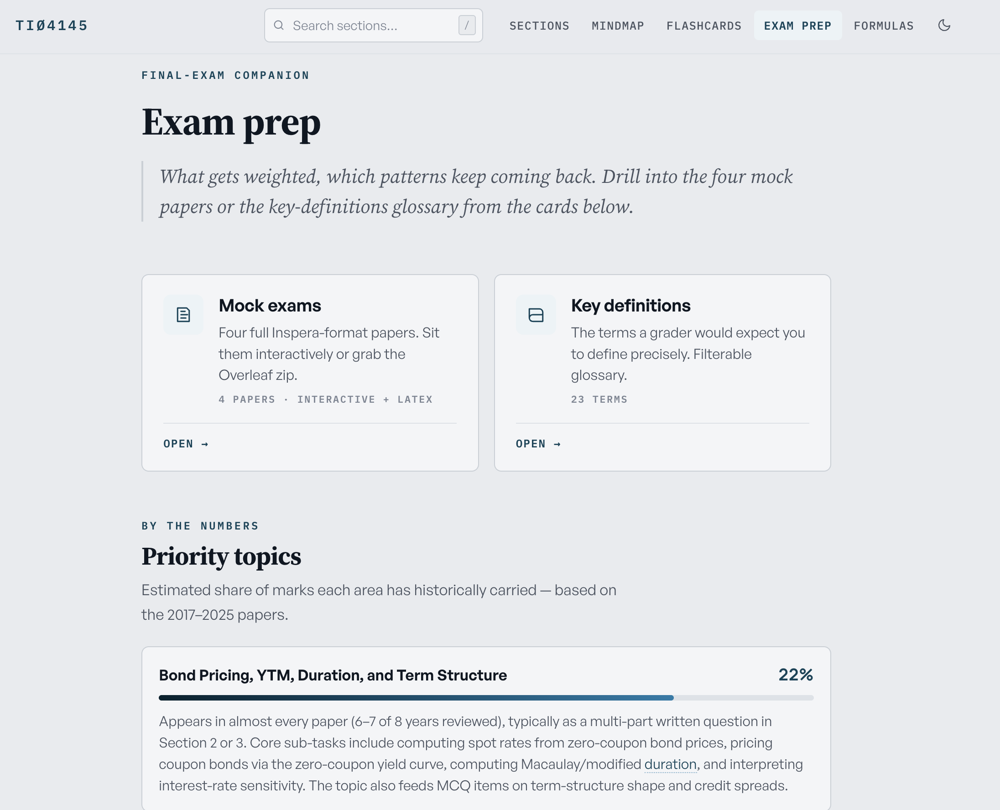
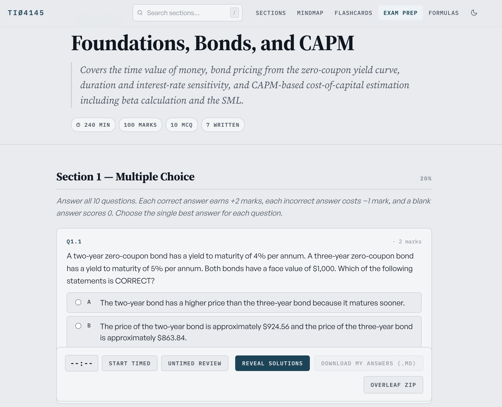
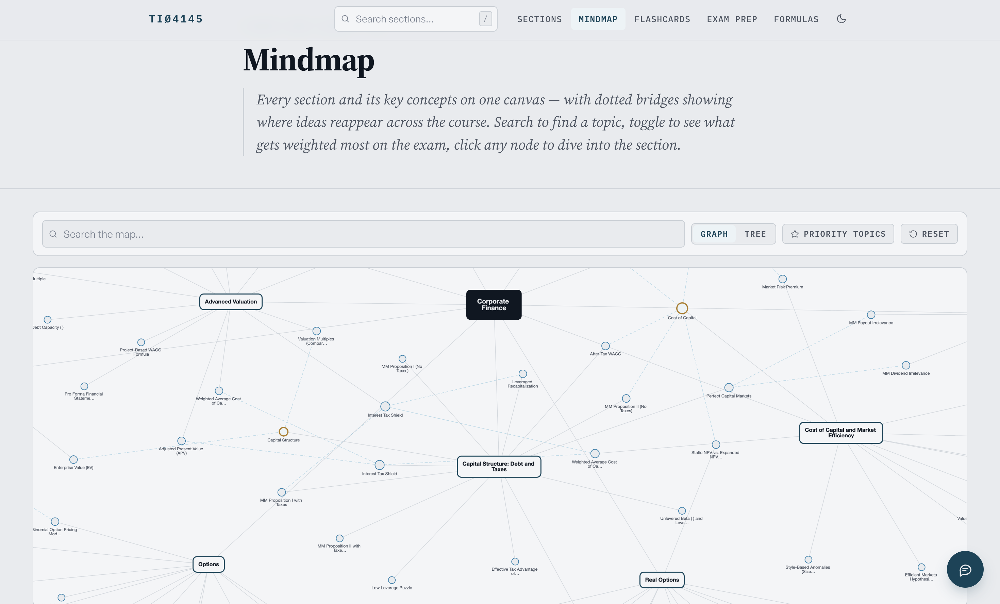
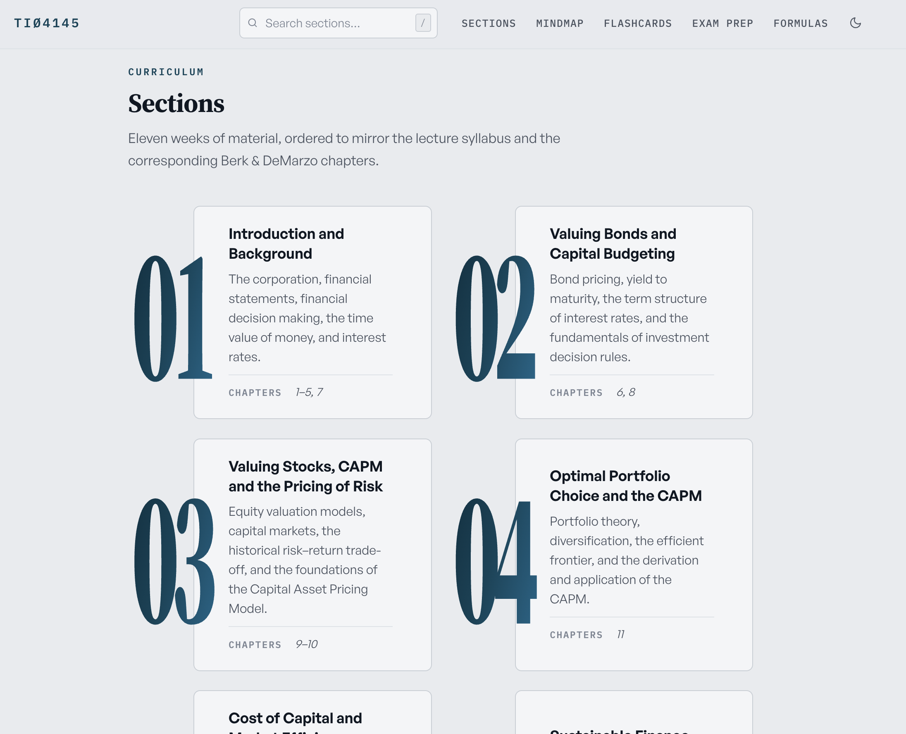

# TIØ4145 — Corporate Finance Study Site

A self-contained study companion for **TIØ4145 Corporate Finance** at **NTNU**
(Department of Industrial Economics and Technology Management). It turns the
lecture slides, the *Berk & DeMarzo* textbook and eight years of past exams
into one searchable site: structured section notes with typeset math,
active-recall flashcards, a weighted exam-prep plan, four full Inspera-format
mock papers, a concept mindmap, a formula sheet, and a chat assistant grounded
in the course materials.

🔗 **Live site: [corpfinance.vercel.app](https://corpfinance.vercel.app)**

<p align="center">
  
</p>

---

## About the course

TIØ4145 is a master's-level course taught by **Maria Lavrutich**. It develops
the modern theory of corporate financial decision-making and applies it to
real-world valuation, financing and investment problems, following the chapter
structure of Berk & DeMarzo, *Corporate Finance*. The exam is a 4-hour digital
**Inspera** paper in four sections — one multiple-choice (with negative
marking) and three written — using a basic calculator and a provided formula
sheet.

This site distills all of that into a study workflow built around three moves:
**read** the notes → **recall** with flashcards → **review** against past
papers.

| | |
|---|---|
| **11** lecture sections | mirroring the syllabus & Berk-DeMarzo chapters |
| **~190** flashcards | tagged easy / medium / hard, with active-recall rating |
| **8** past exams indexed | 2017–2025, including the Inspera 4-section format |
| **4** mock exam papers | full Inspera-style, timed, with Overleaf export |

<details>
<summary><strong>Course outline (11 sections)</strong></summary>

| # | Section | Berk & DeMarzo |
|---|---------|----------------|
| 01 | Introduction and Background | ch. 1–5, 7 |
| 02 | Valuing Bonds and Capital Budgeting | ch. 6, 8 |
| 03 | Valuing Stocks, CAPM and the Pricing of Risk | ch. 9–10 |
| 04 | Optimal Portfolio Choice and the CAPM | ch. 11 |
| 05 | Cost of Capital and Market Efficiency | ch. 12–13 |
| 06 | Sustainable Finance | — |
| 07 | Capital Structure: Debt and Taxes | ch. 14–15 |
| 08 | Payout Policy | ch. 17 |
| 09 | Advanced Valuation | ch. 18–19 |
| 10 | Options | ch. 20–22 |
| 11 | Real Options | — |

</details>

---

## What's inside

### 📖 Section notes
Each lecture week distilled into an overview, key concepts, detailed notes,
worked numerical examples and common mistakes — math typeset cleanly with
KaTeX, figures inline, and a contents rail to jump around. Source slides and
textbook chapters are linked at the top of every section.

<p align="center">
  
</p>

### 🃏 Flashcards
Active recall over every section. Flip, shuffle, filter by difficulty, and rate
each card (Again / Good / Easy / Discard) — the deck reorders to surface what
you find hard. Fully keyboard-driven.

<p align="center">
  
</p>

### 🎯 Exam prep
The highest-yield topics, weighted by their historical share of marks across
the 2017–2025 papers, plus a filterable key-definitions glossary and the
common question patterns from past exams.

<p align="center">
  
</p>

### 📝 Mock exams
Four full Inspera-format papers — section weighting, marks, MCQ negative
marking and all. Sit them timed or as untimed review, reveal worked solutions,
download your answers, or grab the Overleaf `.zip` to write them up in LaTeX.

<p align="center">
  
</p>

### 🕸️ Mindmap
Every section and its key concepts on one canvas, with dotted bridges showing
where ideas reappear across the course. Search a topic, switch between graph and
tree views, filter to priority items, and click any node to dive into the
section.

<p align="center">
  
</p>

### 📚 Curriculum
Every PDF the site was built from — lecture slides, the matching textbook
chapters, the full Berk & DeMarzo book and the past-exam archive — one click
away, organised by week.

<p align="center">
  
</p>

### Plus
A **formula sheet** (every display-mode formula, searchable and grouped by
section), course-wide **search** (press <kbd>/</kbd>), light/dark **theme**, a
**“continue where you left off”** chip, and an optional floating **chat
assistant** that answers questions grounded in the page and the course
materials.

---

## How it's built

The site is **static** — HTML/CSS/JS that `fetch()` JSON at runtime — and the
content is generated from the raw course materials by a small Python pipeline.
`course_config.json` is the single source of truth for course metadata and the
section list.

```
resources/section_NN/   raw PDFs / PPTX (slides, textbook chapters, exams)
        │  scripts/parse_resources.py      → *.parsed.json next to each source
        ▼
generated/sections/<id>.json               scripts/generate_sections.py
generated/flashcards/<id>_flashcards.json  scripts/generate_flashcards.py
generated/exam/exam_prep.json + mock_*.json scripts/generate_exam.py
        │
        ▼
web/*.html   →  fetch the JSON and render the site
```

See [`CLAUDE.md`](CLAUDE.md) for the full architecture, directory roles and
conventions.

### Project layout

```
course_config.json     # course metadata + section list (source of truth)
context/               # course description, exam info, learning outcomes
resources/             # raw PDFs/PPTX, organised by section (+ _exams, _course)
prompts/               # LLM prompt templates ({{var}} substitution)
scripts/               # generation pipeline (Python) + Vercel build
generated/             # script output: the JSON the site fetches
web/                   # the static site
docs/screenshots/      # README screenshots
api/chat.js            # Vercel serverless function for the chat widget
```

---

## Running locally

The pages load JSON via `fetch()`, so you need an HTTP server — opening
`web/index.html` over `file://` will **not** work. Serve from the **repository
root** (the pages reference `../course_config.json` and `../generated/…`):

```bash
# from the repository root:
python -m http.server 8000
```

Then open:

| Page | URL |
|------|-----|
| Landing | <http://localhost:8000/web/> |
| A section | <http://localhost:8000/web/section.html?id=section_10> |
| Flashcards | <http://localhost:8000/web/flashcards.html> |
| Exam prep | <http://localhost:8000/web/exam.html> |
| Mock exam | <http://localhost:8000/web/mock_exam.html?id=mock_01> |
| Mindmap | <http://localhost:8000/web/mindmap.html> |
| Curriculum | <http://localhost:8000/web/curriculum.html> |

> **Tip:** hard-refresh (`Cmd/Ctrl-Shift-R`) after regenerating content — the
> pages cache JSON aggressively.

---

## Regenerating content

Generation calls an LLM. The provider is set by `course_config.json → llm.provider`
(currently `anthropic`); export the matching key first
(`ANTHROPIC_API_KEY`, or `OPENROUTER_API_KEY` for the free-tier default). The
chat widget always uses `OPENROUTER_API_KEY`.

```bash
# Full pipeline: parse → sections → flashcards → exam (+ chat embeddings)
bash scripts/generate_all.sh

# Regenerate one piece
python scripts/parse_resources.py    --section section_03
python scripts/generate_sections.py  --section section_03
python scripts/generate_flashcards.py --section section_03
python scripts/generate_exam.py
```

`generated/` is fully reproducible from `resources/` + the scripts. For
higher-quality parsing of the textbook and exam PDFs (tables, equations), see
the optional [Reducto](https://reducto.ai) path documented in `CLAUDE.md`.

### What each generated file holds

| Path | Shape |
|------|-------|
| `generated/sections/<id>.json` | `{ title, summary, key_concepts[], detailed_notes, common_mistakes[] }` |
| `generated/flashcards/<id>_flashcards.json` | `[ { front, back, difficulty: easy\|medium\|hard }, … ]` |
| `generated/exam/exam_prep.json` | `{ priority_topics[], practice_questions[], key_definitions[], study_schedule[] }` |
| `generated/exam/mock_*.json` | A full mock paper (sections, questions, solutions) |
| `generated/chat/chunks.json` | Embedding index for the chat widget |

---

## Deploying

The repo is wired for **Vercel**. `npm run build` (`scripts/vercel_build.mjs`)
assembles `dist/` — the static site plus the committed `generated/` JSON and the
resource PDFs — and `api/chat.js` runs as a serverless function. Set
`OPENROUTER_API_KEY` in the Vercel project environment for the chat widget.

```bash
npm run build      # → dist/   (or just push; Vercel builds on deploy)
```

---

## Updating the screenshots

The README screenshots live in `docs/screenshots/` — one PNG per page
(`landing.png`, `section.png`, `flashcards.png`, `exam.png`, `mockexam.png`,
`mindmap.png`, `curriculum.png`), light theme. To refresh one, retake it from
the live site (or a local server) and overwrite the file — e.g. a headless
capture with the Playwright CLI:

```bash
npx playwright screenshot --color-scheme light --viewport-size "1440,900" \
  --wait-for-timeout 4500 \
  "https://corpfinance.vercel.app/web/index.html" docs/screenshots/landing.png
```

---

## Credits

Course: **TIØ4145 Corporate Finance**, NTNU — Department of Industrial Economics
and Technology Management, lecturer **Maria Lavrutich**. Textbook: Berk &
DeMarzo, *Corporate Finance*. Site built and maintained by **Camilla**.
Spot a mistake? Get in touch.
